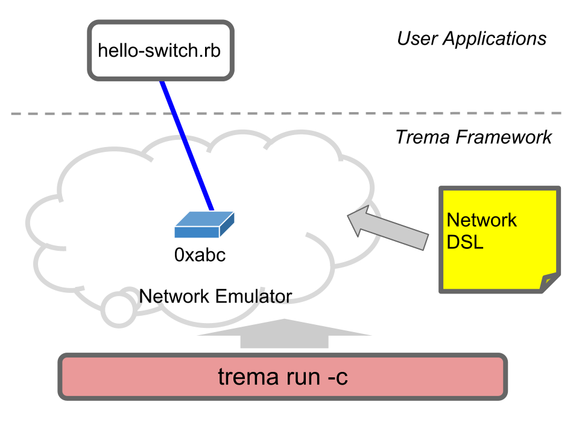

<!SLIDE>
# Task B: Hello Switch! ########################################################
## Connect an OpenFlow switch to controller

<!SLIDE>
## "Wait, I don't have any OpenFlow switch.   How to do that?"

<!SLIDE small>
# Exercise: Hello Switch Controller ############################################

	$ trema run hello-switch.rb -c hello-switch.conf
	Password: gec13user  # Enter your password here
	Hello 0xabc!  # Ctrl-c to quit

* Connects a <b>virtual switch (dpid = 0xabc)</b> to the controller
* The controller outputs `"Hello 0xabc!"`
* Virtual switch is defined in `hello-switch.conf`

<!SLIDE center>

<!SLIDE small>
# hello-switch.conf ############################################################

	@@@ ruby
	#    
	# Add a switch with dpid == 0xabc
	#    
	vswitch { dpid "0xabc" }
	# or
	vswitch { datapath_id "0xabc" }

* Launches a software switch that establishes connection with the controller
* Trema is a <b>full-stack</b> framework. A single laptop is all that is needed, no physical switches!

<!SLIDE small>
# `hello-switch.rb` ############################################################

	@@@ ruby
	class HelloSwitch < Controller
	  def switch_ready dpid
	    info "Hello #{ dpid.to_hex }!"
	  end
	end

* `switch_ready` is an handler called when a switch connects to the controller
* the argument `dpid` is switch's ID (integer in decimal format)
* `.to_hex` converts the `dpid` into a hex format String

<!SLIDE small>
# Exercise: Adding Switches ####################################################

	@@@ ruby
	# hello-switch.conf
	vswitch { dpid "0x1" }
	vswitch { dpid "0x2" }
	vswitch { dpid "0x3" }
	  ...

	$ trema run hello-switch.rb -c hello-switch.conf
	???

* What `trema run` would indicate if adding some switches to `hello-switch.conf`?
* NOTE: dpid's of each switch must be unique

<!SLIDE small incremental transition=uncover>
# Summary So Far ###############################################################

## Trema is a "Post-Rails", modern development environment

 

* <i>Run It Quick</i>: `trema run`
* <i>Convention Over Coding</i>: method naming convention
* <i>Full-Stack</i>: virtual network DSL
* Useful sub-commands: `trema ruby`
