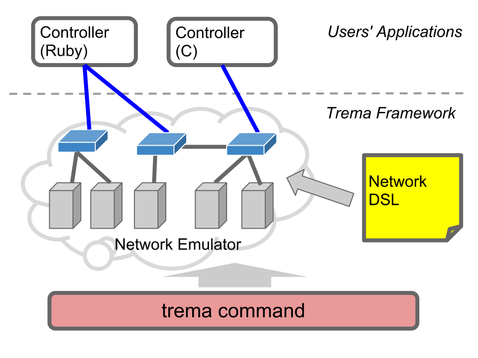

<!SLIDE title-slide>
# Trema Tutorial ###############################################################

### Yasuhito Takamiya  `@yasuhito`
### Yasunobu Chiba  `@chibacchie`
### Hideyuki Shimonishi  `@hide_shimonishi`
### Nick Karanatsios `@nickkaranatsios`

<!SLIDE small>
# Today's Goal #################################################################

## Implement a "L2 switch with traffic monitoring" controller

* This tutorial consists of five small sections starting from "Hello World"
* Let's go through the entire cycle of OpenFlow controller development using Trema

<!SLIDE small incremental>
# What's Trema? ################################################################

* A New OpenFlow programming framework in Ruby and C
  * GPL2
  * <http://github.com/trema/trema>
* Designed to be highly productive for this "Post-Rails" era
  * <i>Run It Quick</i>: Tight loop of coding, run, and debug
  * <i>Coding by Convention</i>: Write it short
  * <i>Integrated Unit-Testing</i>

<!SLIDE>
# Trema = ######################################################################
## OpenFlow controller library (in Ruby and C)
## +
## Network Emulator
## +
## `trema` command

<!SLIDE center>

