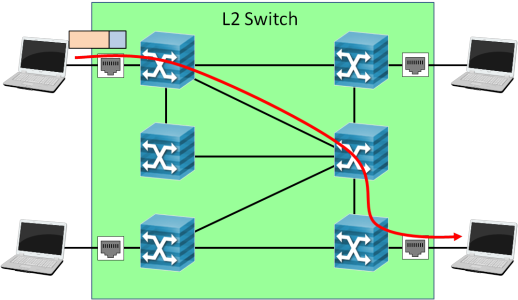
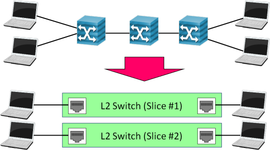
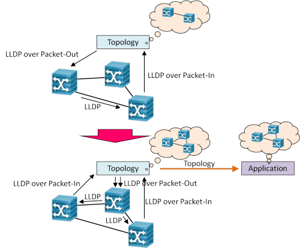
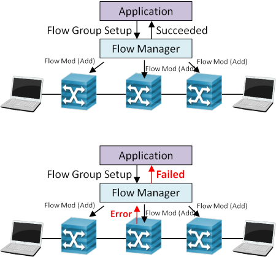

<!SLIDE>
# Summary #######################################################################

<!SLIDE small incremental transition=uncover>
# Trema: "OpenFlow like Rails" ##################################################

* <i>Run It Quick</i>: Tight loops of coding, run, and debug
  * Virtual network DSL
  * `trema {run, send_packets, show_stats, up, kill}`
* <i>Convention Over Coding</i>: Write it short
  * Auto handler dispatch by naming convention
  * Class attributes: `periodic_timer_event`
  * Syntactic sugars: `ExactMatch.from`
  * Default options: `send_flow_mod_add`
* <i>Useful Sub-commands</i>
  * `trema {dump_flows, ruby}`

<!SLIDE small>
# Next Step For Developers #####################################################

* `[trema]/src/examples`
  * Simple samples demonstrating API usage
  * Good references for understanding both Ruby and C APIs
* Trema/Apps <http://github.com/trema/apps>
  * Practical/experimental controllers developed on top of Trema
  * Good starting point for developing real-world controllers

<!SLIDE small>
# Trema/Apps: Routing Switch ###################################################

* Creates a Layer-2 switch consists of OpenFlow switches
* Resolves internal paths with a shortest path algorithm

<!SLIDE small>
# Trema/Apps: Sliceable Routing Switch #########################################

* Creates virtual L2 network domains (slices) with L1-4 ACL
* Has REST-API for slice and ACL management
  * Create/delete a slice
  * Attach/detach a host to/from a slice
  * Add/delete an ACL entry

<!SLIDE small>
# Trema/Apps: Topology #########################################################
* Discovers network topology using LLDP frames
* Provides API for retrieving a discovered topology from other application

<!SLIDE small>
# Trema/Apps: Flow Manager #####################################################
* Provides API for managing a set of flow entries as a single group
* Guarantees all entries in a group are properly installed and removed

<!SLIDE>
# Love Ruby? ###################################################################

<!SLIDE>
# Love C? ######################################################################

<!SLIDE small>
# Trema C ######################################################################

* It's your choice ... Trema provides libraries for both Ruby and C
* Trema C is also simple as Trema Ruby

 

	$ gcc myapp.c `trema-config -c -l` -o myapp
	$ trema run myapp

<!SLIDE small>
# Sources ######################################################################

* Trema: <http://github.com/trema/>
* This Tutorial: <http://github.com/trema/GEC13/>
* Trema/Apps: <http://github.com/trema/apps/>
* Web Page: <http://trema.github.com/trema/>
* Twitter: <http://twitter.com/trema_news>
* Mailing List: <https://groups.google.com/group/trema-dev>
* Bugs: <https://github.com/trema/trema/issues>

<!SLIDE small>
# Contributors! ################################################################

* Free Trema T-shirt for contributors!
  * Patch (New features/apps, enhancements, bug-fixes)
  * Bug report
  * Documentation etc.
* Send pull-requests and get the T!

<!SLIDE>
# Questions? ###################################################################

